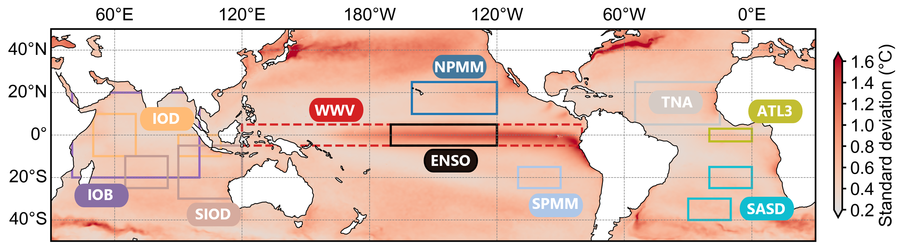
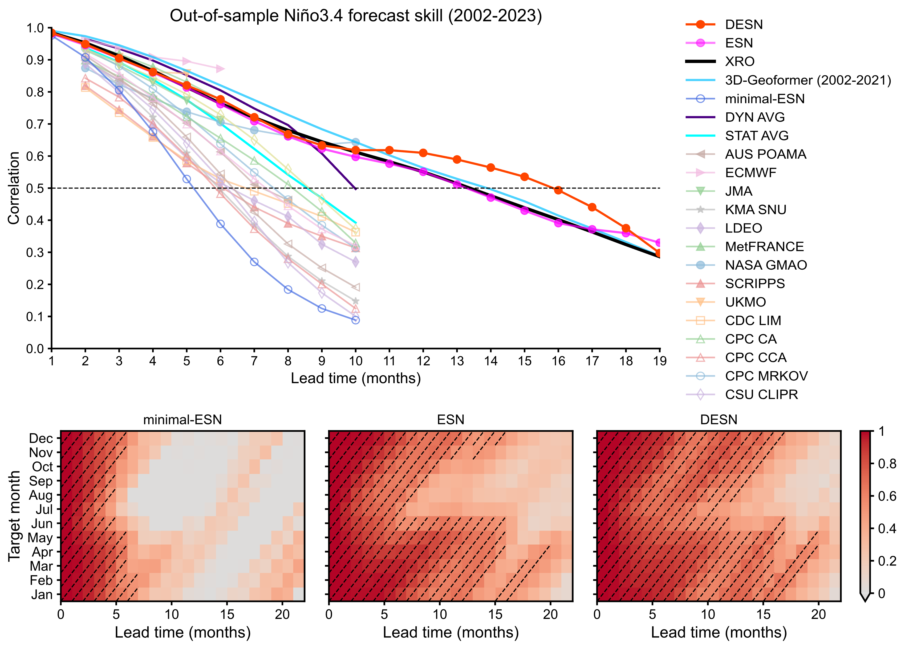
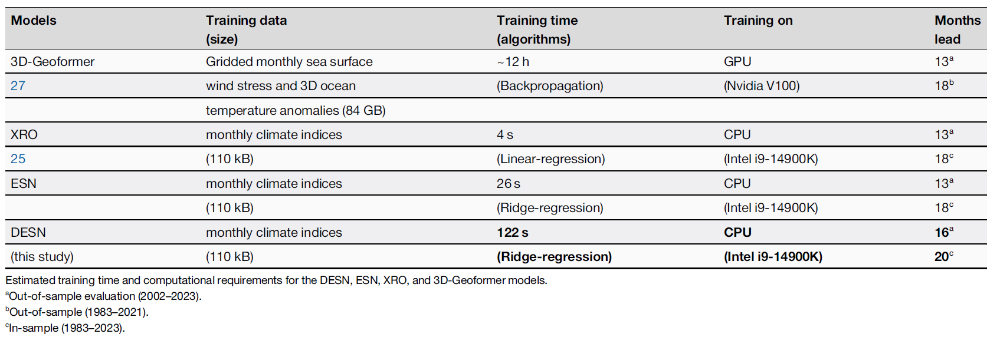

# RCENSO-simple

## Overview

ENSO (El Niño–Southern Oscillation) is the dominant source of interannual climate variability, but its predictability is fundamentally limited by nonlinear ocean–atmosphere dynamics. This repository implements a **Deep Echo State Network (DESN)** approach to multi-variable ENSO forecasting that extends predictability by capturing higher-order nonlinear couplings across the Pacific, Indian, and Atlantic basins.

### Input: 10 Climate Modes across Three Ocean Basins



The model ingests 10 monthly climate indices derived from the ORAS5 reanalysis (XRO model selected but also support more or less or others related indices), covering the major ENSO-driving teleconnections: **Niño3.4** (ENSO target), **WWV** (warm water volume), **NPMM**, **SPMM** (meridional modes), **IOB**, **IOD**, **SIOD** (Indian Ocean), **TNA**, **ATL3**, **SASD** (Atlantic). These regions are shown in Fig. 1a overlaid on the global SSTA standard deviation map.

### Architecture: Stacked Reservoirs with Higher-Order Nonlinear Features


The DESN stacks $n_l$ recurrent reservoirs in series (Fig. 1b). Each reservoir $l$ evolves according to:

$$\mathbf{r}^l_{t+1} = (1-\alpha^l)\mathbf{r}^l_t + \alpha^l g(\mathbf{W}^l_\text{in} X^l_t + \mathbf{W}^l_\text{res} \mathbf{r}^l_t) + \xi^l_\text{rc}$$

Because Reservoir 2 receives Reservoir 1's nonlinear states as inputs, its neurons implicitly encode **higher-order couplings** (2nd → 3rd order and beyond) and **multi-timescale dynamics** that a single-layer ESN cannot represent. The Demo figure illustrates this concretely: Reservoir 1 neurons exhibit regular seasonal-cycle oscillations, while Reservoir 2 neurons display far richer, irregular temporal patterns. All reservoir states are concatenated and mapped to next-month predictions by a single linear readout $\mathbf{W}_\text{out}$, keeping the training problem convex.

### Forecast Skill: Skillful Long-Lead ENSO Prediction



DESN (red) achieves the highest out-of-sample Niño3.4 correlation skill among all compared models out to ~19 months lead time — outperforming XRO (black), 3D-Geoformer (blue), dynamical model ensembles (DYN AVG), and a broad suite of operational forecasting systems. The dashed line marks the ACC = 0.5 skill threshold. The target-month heatmaps (bottom row) show that DESN maintains ACC > 0.5 across virtually all initialisation months at leads up to 12–18 months, a region of high skill markedly larger than for the single-layer ESN or minimal-ESN configurations.

### Computing Efficiency

DESN offers substantial computational efficiency. It trains in seconds on a standard CPU, with runtimes comparable to the XRO while achieving forecast skill that matches or exceeds both dynamical and deep learning approaches:



## Data

| File | Description |
|------|-------------|
| `data/oras5_indices_1958-2025.nc` | ORAS5 reanalysis dataset — 10 monthly climate indices: Niño3.4, WWV, NPMM, SPMM, IOB, TNA, ATL3, IOD, SIOD, SASD |
| `data/sourcedata/` | Pre-computed results for `plot_result.ipynb` (forecast skill comparisons with other published models) |

## Runtime Reference

Benchmarked on Intel Core i9-14900K (single-threaded reservoir update). Training and inference time scales linearly with `nmembers`.

| Architecture | Reservoir size | Time per member (train + forecast) |
|---|---|---|
| Single-layer ESN (`n_l=1`) | 20 000 | ~30 s |
| Two-layer DESN (`n_l=2`) | 20 000 + 12 000 | 3–5 min |
| Three-layer DESN (`n_l=3`) or larger | 20 000 + 12 000 + … | 10 min+ |

> `nmembers` multiplies the above times directly. For example, a two-layer DESN with `nmembers=10` takes roughly 30–50 minutes. Fig. 4 (`error_growth.ipynb`) : Due to error perturbations, it is necessary to verify robustness under different initial conditions and evolve enough steps, roughly 5 times(100 months) vs forecast inference (21 months); this typically requires a runtime of `init_perturbs * nmembers * time per member * 5`.

## Scripts

### `RCENSO.py`

Core library module. Import with `from RCENSO import *` and is organized into five sections:

- **Section 1 — Model Construction**: `Create_New_ESN`, `Create_New_IPESN`, `Create_Online_ESN`, `Create_Deep_ESN`, `get_hyperparameters`, `get_esn_from_hypers` — build single-layer and deep reservoir networks with optional IP (Intrinsic Plasticity) adaptation.
- **Section 2 — Training & Prediction**: `pack_TS_anualTP`, `get_RCTP`, `TPRC_Forecast_Train_Test_Ensemble`, `TPRC_Train_Ensemble`, `TPRC_Forecast_Ensemble`, `dimension_addition_ensemble_forecast`, `dimension_reduction_ensemble_forecast`, `dimension_addition_xro_forecast`, `dimension_decoupling_xro_forecast` — train ensemble DESN models with temporal-period encoding and run multi-step rolling forecasts; mode attribution experiments.
- **Section 3 — Analysis**: `ndforecast_skill`, `calculate_ensemble_skill`, `cal_rmse`, `fast_stochastic_ESN_error_growth` — compute Pearson correlation, RMSE, and perturbation error growth as functions of lead time.
- **Section 4 — Visualization**: `plot_main_skills_with_legend`, `visualize_skill_vs_baseline`, `visualize_skill_comparison_vs_baseline` — publication-quality forecast skill plots.
- **Section 5 — Helpers**: `reorder_and_rename_results`, `convert_to_standard_calendar`, `standardize_time_to_month_start` — time-axis utilities and result reordering.

## Notebooks

### `train_pred.ipynb` — DESN Training and Forecast Evaluation  *(Fig. 2)*

Trains DESN ensemble models and evaluates out-of-sample Niño3.4 forecast skill against XRO, reproducing the skill curves in **Fig. 2** of the paper.

**Workflow:**
1. Load ORAS5 dataset; split into train (`1958–1999`) and test (`2003–2025`) sets.
2. Configure two DESN architectures: single-layer `DESN(n_l=1)` (20 000 units, IP reservoir) and two-layer `DESN(n_l=2)` (20 000 + 12 000 units).
3. Train `nmembers` independent ensemble members per architecture via `TPRC_Forecast_Train_Test_Ensemble`; average across both architectures for the final DESN prediction.
4. Train XRO benchmark (`ac_order=2`, nonlinear terms on Niño3.4 and IOD); generate deterministic reforecasts.
5. Compute and plot Pearson correlation vs. lead time for Niño3.4 (and all other modes).

**Output:** Out-of-sample Niño3.4 forecast skill curves for DESN and XRO (Fig. 2).

### `mode_decoupling.ipynb` — Mode Decoupling Experiment  *(Fig. 3a–b)*

Quantifies the contribution of each climate mode by removing it from the predictor set and measuring the skill degradation, reproducing **Fig. 3a–b** of the paper.

**Workflow:**
1. Load ORAS5 dataset; training period `1958–1999`, evaluation period `2000–2024`.
2. Train baseline DESN (all 10 modes) and 9 leave-one-out variants via `dimension_reduction_ensemble_forecast`.
3. Run equivalent XRO decoupling experiments via `dimension_decoupling_xro_forecast`.
4. Compute skill for each configuration; plot side-by-side skill-change bars with `visualize_skill_comparison_vs_baseline`.

**Output:** Side-by-side plots showing ΔR when each mode is excluded for XRO (Fig. 3a) and DESN (Fig. 3b). Removing WWV causes the steepest long-lead skill drop; DESN exploits WWV through higher-order nonlinear interactions not captured by XRO.

### `mode_addition.ipynb` — Mode Addition Experiment  *(Fig. 3c–d)*

Starts from a minimal Niño3.4 + WWV model and measures the incremental skill gain from adding each inter-basin mode, reproducing **Fig. 3c–d** of the paper.

**Workflow:**
1. Load ORAS5 dataset; training period `1958–1999`.
2. Train baseline DESN (Niño3.4 + WWV) and 8 one-addition variants via `dimension_addition_ensemble_forecast`.
3. Run equivalent XRO addition experiments via `dimension_addition_xro_forecast`.
4. Plot skill gain $A_{\text{mode}}$ for each mode with `visualize_skill_comparison_vs_baseline`.

**Output:** Side-by-side plots showing $A_{\text{mode}}$ (skill gain from adding each mode) for XRO (Fig. 3c) and DESN (Fig. 3d). Extended skill emerges only when WWV is paired with cross-basin modes; NPMM yields the largest improvement.

### `error_growth.ipynb` — DESN Error Growth Analysis  *(Fig. 4b)*

Quantifies how initial perturbations of varying amplitude grow under DESN dynamics, reproducing **Fig. 4b** of the paper.

NOTE: The runtime cost is relatively long to other notebook (see Sec **Runtime Reference**) 

**Workflow:**

1. Load ORAS5 dataset; training period `1958–1999`.
2. Train the two-layer DESN on the training period via `fast_stochastic_ESN_error_growth`.
3. For each of ten initial perturbation amplitudes $\delta_0$ (from $10^{-5}$ to $3$), run `nmembers` stochastic trials to estimate the mean error-ratio trajectory $\delta_i/\delta_0$ over 101 steps.
4. Plot $\ln(\delta_i)$ vs. lead time with the 90%-saturation step marked per amplitude.

**Output:** Log-error growth curves showing that, once $\delta_0 < 0.1$, the saturation level and inferred predictability limit remain largely unchanged (Fig. 4b).

### `plot_result.ipynb` — Benchmark Comparison  *(Fig. 2)*

Plots DESN forecast skill against a broad set of published dynamical and statistical models using pre-computed results, reproducing the multi-model skill panels of **Fig. 2** in the paper.

**Workflow:**
1. Load `fs_ds_to_plot_end.pickle` (out-of-sample, 2002–2023) and `rfs_ds_to_plot_end.pickle` (in-sample reforecast, 1979–2023) from `data/sourcedata/`.
2. Plot Niño3.4 Pearson correlation vs. lead time for all models using `plot_main_skills_with_legend`.

**Output:** Multi-model out-of-sample and in-sample Niño3.4 skill comparison figures (Fig. 2a–b).

### Typical Run Order

```
train_pred.ipynb        # DESN vs XRO skill evaluation  → Fig. 2
mode_decoupling.ipynb   # leave-one-out mode decoupling → Fig. 3a–b
mode_addition.ipynb     # one-mode-addition experiment  → Fig. 3c–d
error_growth.ipynb      # DESN perturbation error growth → Fig. 4b
plot_result.ipynb       # multi-model benchmark (pre-computed data) → Fig. 2
```
