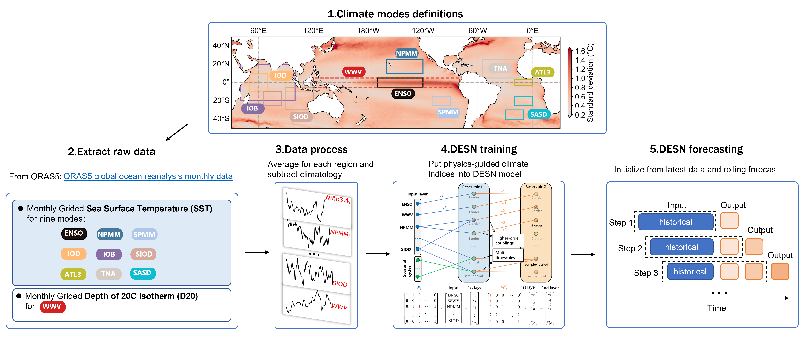
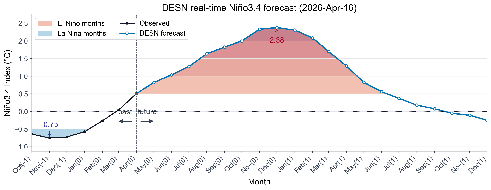

# REPORT

起报时间: 2026年4月 | 时效: 20个月 (2026-04 至 2027-12)  

模型: DESN | 代码: https://github.com/zhangzejing/RC-ENSO

作者：张泽泾 | 邮箱: zjuer_zzj@163.com

---

## 一、数据简介

### 原始数据

ORAS5 (Ocean ReAnalysis System 5) 由 ECMWF 运行，是 Copernicus C3S 全球海洋再分析产品，分辨率 0.25°×0.25°，垂向 75 层，覆盖 1958 年至今。同化系统为 NEMO 海洋模式 + NEMOVAR 3D-Var FGAT，同化卫星 SST、海面高度、Argo 温盐廓线及海冰密集度。

- 官网: https://www.ecmwf.int/en/research/climate-reanalysis/ocean-reanalysis  
- 数据获取: https://cds.climate.copernicus.eu

本预报使用其中两个物理量：海表温度 (Sea Surface Temperature, SST `sosstsst`) 和 20°C等温线深度 (Depth of 20°C isotherm, D20 `so20chgt`)。原始数据为逐月气候格点数据（空间分辨率0.25°×0.25°，覆盖时间1958-01至2026-04，长度814 个月）。

### 处理后数据

**1.构造区域时间序列：**两个变量（**Variable**）的对应模式（**mode**）所指向区域（**Region**）按以下区域进行格点空间平均，每个模式得到一条时间序列，共计10条时间序列（时间长度814 个月）：

| #    | Mode    | Full Name                         | Region (lat, lon)                            | Variable |
| ---- | ------- | --------------------------------- | -------------------------------------------- | -------- |
| 1    | Niño3.4 | Niño 3.4 Index                    | 5°S–5°N, 170°W–120°W                         | SST      |
| 2    | WWV     | Warm Water Volume                 | 5°S–5°N, 120°E–80°W                          | D20      |
| 3    | NPMM    | North Pacific Meridional Mode     | 10°–25°N, 160°W–120°W                        | SST      |
| 4    | SPMM    | South Pacific Meridional Mode     | 25°–15°S, 110°–90°W                          | SST      |
| 5    | IOB     | Indian Ocean Basin Mode           | 20°S–20°N, 40°–100°E                         | SST      |
| 6    | TNA     | Tropical North Atlantic Index     | 5°–25°N, 55°–15°W                            | SST      |
| 7    | ATL3    | Atlantic Niño 3 Index             | 3°S–3°N, 20°W–0°                             | SST      |
| 8    | IOD     | Indian Ocean Dipole               | (10°S–10°N, 50°–70°E) − (10°S–0°, 90°–110°E) | SST      |
| 9    | SIOD    | Southern Indian Ocean Dipole      | (25°–10°S, 65°–85°E) − (30°–5°S, 90°–120°E)  | SST      |
| 10   | SASD    | South Atlantic Subtropical Dipole | (40°–30°S, 30°–10°W) − (25°–15°S, 20°W–0°)   | SST      |

**2.去季节循环：**

即计算月距平，设原始序列为 $X(t)$，$t$ 表示时间，$M(t)$ 表示气候态时间段对应的月份，月距平为：
$$
X'(t) = X(t) - \overline{X}_{M(t)}
$$

其中：

- $X(t)$：原始值
- $\overline{X}_{M(t)}$：气候态时间段对应的月份的序列平均值
- $X'(t)$：月距平

其中气候态时间段为1979-01至2009-12

**3.去二次趋势：**

将时间转为月份序号 $\tau(t)$，并拟合二次趋势：

$$
\hat{X}'(t) = a\tau(t)^2 + b\tau(t) + c
$$

去趋势后为：

$$
X''(t) = X'(t) - \hat{X}'(t)
$$

其中：

- $\tau(t)$：从序列起点开始的月份序号
- $a,b,c$：二次趋势拟合系数
- $\hat{X}'(t)$：拟合趋势
- $X''(t)$：去二次趋势后的月距平

最终得到去季节循环、去二次趋势后的气候模式指数。

## 二、预报算法和流程

***Figure:** Schematic workflow of the DESN real-time ENSO forecasting system. Climate-mode indices are extracted from ORAS5 monthly ocean reanalysis fields, including regional sea surface temperature indices and equatorial warm water volume. The processed indices are used to train the DESN model, which is then initialized with the latest available observations to produce rolling real-time forecasts.*

上图所示的**1.区域定义**（**Climate mode definitions**）和**2.数据提取和3.数据处理**（**Extract raw data & Data process**）环节已由第一部分介绍。

关于**4.模型训练**（**DESN training**）和**5.模型预测**（**DESN forecasting**）环节，下面为简单的介绍

DESN 是一种物理引导的轻量化机器学习预报模型，详见:

- [Enhancing the predictability limits of ENSO with physics-guided deep echo state networks | npj Climate and Atmospheric Science](https://www.nature.com/articles/s41612-026-01360-5)

- https://github.com/zhangzejing/RC-ENSO。

**输入**：第一部分介绍的气候指数，并上年循环及半年循环时间周期编码（Seasonal cycles）。

**输出**：新1个月的10个气候模态指数，通过滚动输入（rolling-input）获取更多月预测结果。

**训练与验证标准流程**：

- 训练集：1979–2020（504个月） | 远期验证：1958–1978（252个月） | 近期验证：2021–2026（63个月）
- 集合训练：5 × DESN(n_l=1) + 5 × DESN(n_l=2) = 10 成员，各自独立随机初始化
- 成员筛选：在验证集上，穷举搜索 C(10,4) 至 C(10,10)，评分函数为加权 Niño3.4 皮尔森相关（lead 1–15），选出最优子集
- 实时预报：迭代滚动，每步将 DESN 输出与对应时间周期编码拼接作为下步输入，共滚 20 步

## 三、预报结果

***Figure:** DESN real-time Niño3.4 forecast initialized on 16 April 2026. The black curve shows the observed Niño3.4 index before initialization, and the blue curve shows the DESN ensemble-mean forecast afterward. Red and blue shading mark months exceeding the El Niño and La Niña thresholds, respectively. The vertical dashed line separates the observed past from the forecast future, and the annotated values indicate the strongest warm and cold anomalies.*

本次预测初始化时间为 **2026 年 4 月 16 日**。DESN 预测显示，Niño3.4 指数将从当前接近中性偏暖状态快速升高，并于 **2026 年 5 月** 起超过 **+0.5°C** 的 El Niño 阈值。ENSO信号将在 2026 年夏季至秋季持续增强，并在 **2026 年 12 月前后达到峰值**，峰值约为 **+2.38°C**，对应一次较强的 El Niño 事件。

2027 年初之后，暖异常逐渐减弱，预计在 **2027 年5 月前后** 回落至 El Niño 阈值以下。之后，Niño3.4 指数接近中性并略偏冷，但预测期内尚未显示明确 La Niña 发展信号。

总体来看，DESN 预测倾向于 **2026-2027 年发生一次中等及以上强度的 El Niño 事件概率较高**，成熟期可能出现在 **2026 年冬季**。

